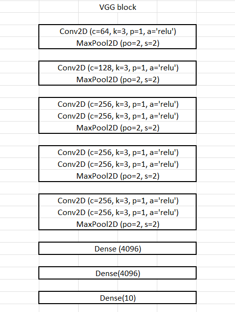
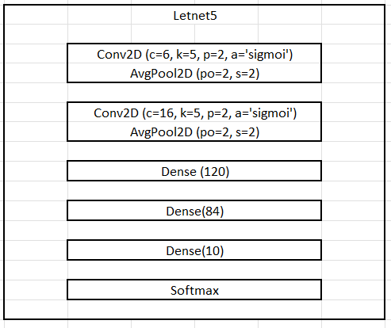

# Image-Classification-using-CIFAR-10-dataset

The CIFAR-10 Dataset is an important image classification dataset. It consists of 60000 32x32 colour images in 10 classes (airplanes, automobiles, birds, cats, deer, dogs, frogs, horses, ships, and trucks), with 6000 images per class. There are 50000 training images and 10000 test images.

## Project implementer
project implemented by Nguyen Minh Quan, final year student at the Ho Chi Minh University of Science, major Data Science

## Project details
The project uses the CIFAR-10 dataset available in the keras library, With a dataset with 5000 samples, I split it into 2 training sets and
validation set with rate ( 0.75, 0.25), I used the **VGG-11** model and **CNN(Letnet5)** model to classify images in the dataset, I use the Adam optimization method with a learning rate of 0.0001 and loss funtion is *categorical_crossentropy*

### VGG-11 Model
The original VGG network has 5 convolutional blocks, where the first two blocks consist of one convolutional layer each, the remaining three blocks contain two convolutional layers each. The first block has 64 output channels, each subsequent block doubles the number of output channels until reaching the value 512. Because this network uses 8 convolution layer and 3 fully connected layer so it is often called VGG-11.

Input shape: (32, 32, 3)
Block 1: (16, 16, 64)
Block 2: (8, 8, 128)
Block 3: (4, 4, 256)
Block 4: (2, 2, 512)
Block 5: (2, 2, 512)
Dense 1: (4096)
Dense 2: (4096)
Dense 3: (10)
Act: softmax
The model has a total of 28,144,010 parameters
After block 5 instead of using Flaten I use MaxGlobal, since I want to get the most prominent features of each channel instead of the whole set of values ​​this may reduce the efficiency of the model but it reduces the parameters so the learning process becomes faster.
The accuracy of the VGG-11 model with Cifar-10 dataset is 84.82%
### CNN (Letnet5)
In the Letnet5 network, there are two parts: convolutional layers and fully connected layers
+ In the convolution part, there are 2 convolution layers along with 2 averaging layers with relu activation function The average pooling layer extracts features smoother than max pooling
+ In fully connected, there will be 3 layers with outputs of 120, 84, and 10 

Input shape: (32, 32, 3)
Conv2D(1): (28, 28, 6)
Conv2D(2): (10, 10, 16)
Dense 1: 120
Desen 2: 84
Dense 3: 10
Act: Softmax
The model has a total of 62,006
The accuracy of the Letnet-5 model with Cifar-10 dataset is 54.75%

## Result
The accuracy of the VGG-11 network is much greater than the Letnet-5 network because the VGG-11 network is deeper with 8 convolutional layers and 3 fully connected layers while Letnet-5 only has 2 convolutional layers and 3 layers. Full connection
## The GOALS of this project are to:

Evaluate the difference between VGG model and normal CNN model

## Tools:

GPU-enabled Tensorflow

Keras API